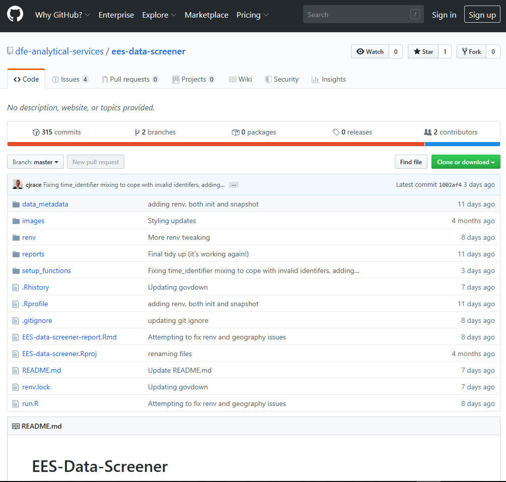
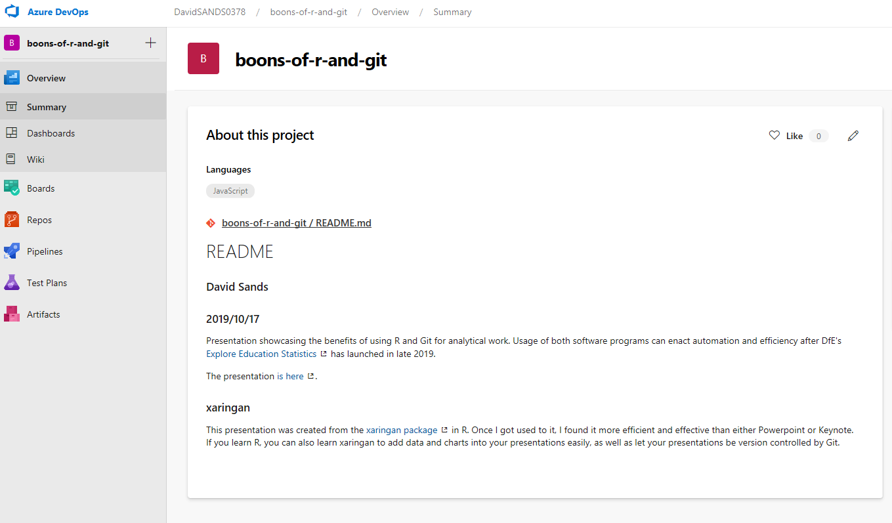

<!-- Example of a comment -->

```{r setup, include=FALSE}
options(htmltools.dir.version = FALSE)
knitr::opts_chunk$set(warning = FALSE, message = FALSE)
```

# Introduction

Using R and Git for your analytical work is an order of magnitude more reproducible, efficient, and _cool_ than using a twisted trinity of SQL, Excel, and Word. 

???

That's enough dating for today folks...yous have got wife's and husbands to go home to!

But, just as a healthy relationship promotes personal growth, so shall I show you how you can use R and Git to grow as an analyst in a healthy, nourishing, polyamorous relationship. 

---

# Content

First I'll talk about the statistical programming language `R`, and how it can replace operations traditionally run in `SQL` and `Excel`. 

And then, I will show how you can ensure your analytical work is auditable, explainable, and reproducible with the version control software `Git`. 

???

Imagine this - EES is released and writing publications is now a doddle. Now that time has been saved there, you've got a bit more time to automate and enhance the other work you do. 

How are you going to do that?

By using these two buddies of yours. 

---

# R 

R is class. It runs data querying, data manipulation, data presentation, and data visualisation **all in one**. 

---

# SQL Ops in R

You can pass literal `SQL` queries to R, or learn the `dplyr` suite of commands to translate SQL data querying commands in R.

```{r sql-import, echo=FALSE}
# Import needed packages
library(DBI)
library(odbc)

# In this example I'm using a DfE database I can access. 
conn1 <- dbConnect(odbc(), .connection_string = "driver={SQL Server}; server=3DCPRI-PDB16\\ACSQLS; database=KS5")

# Example of dbReadTable function from the DBI package. This reads an entire table from SQL into your R enviornment as a Data Frame
results_2017 <- DBI::dbReadTable(conn1, Id(schema = "dbo", table = "KS5_England_Results_2017"))
```

Here is a standard SQL query. It returns KS5 performance data from schools in the Sheffield Local Education Area for summer 2017

```{r sql-op}
# Example of standard SQL Select statement
sql_select <- DBI::dbGetQuery(conn1, "SELECT SCHNAME, TALLPUP_ACAD_1618, 
TALLPPEGRD_ACAD_1618
FROM dbo.KS5_England_Results_2017
WHERE LEA = 373 -- We're selecting schools from Hilly Sheffield. Ey up!
ORDER BY TALLPPE_ACAD_1618 DESC")

DBI::dbDisconnect(conn1)
```

---

# R version of SQL commands

And then, here's all the same ops in R

```{r dplyr-op}
# Now here's an example of how to translate the above statement into R commands
# First, we import the dplyr package. This provides commands for the vast majority 
# of data manipulation you need to do
library(dplyr)

# Second, pull in the data you'll use. This replaces the FROM statement.
# Notice as well the below '%>%'? It is called a 'pipe'. It pipes (or chains) 
# commands together so that they can be executed at the same time. 
# To produce a pipe, type CTRL + SHIFT + M:
dplyr_select <- results_2017 %>% 
# Then replace the where statement with a filter statement:
  filter(LEA == 373) %>% arrange(desc(TALLPPE_ACAD_1618)) %>% 
# Then select the variables you want to pull through:
  select(SCHNAME, TALLPUP_ACAD_1618, TALLPPEGRD_ACAD_1618)
```

---

```{r sql-result}
knitr::kable(sql_select, format = "html")
```

???

And here's proof they produce the same results!

---

```{r dplyr-result}
knitr::kable(dplyr_select, format = "html")
```

So, if you can do standard SQL querying in R...why not start trying it out?

---

# SQL Ops and their R translations 

```{r sql-and-r, echo=FALSE}
library(kableExtra) # renders R tables in HTML files

knitr::kable(
  data.frame(
    SQL_Statements = c(
      "Select Top 100 *",
      "Order By Col A (DESC)",
      "Group By Col A",
      "Select Function(COL A, COL B) 'New Column Name'",
      "From Table A
      Left Join Table B
      On A.Key = B.Key"
    ),
    DPLYR_Version = c(
      "top_n(100)",
      "arrange(desc(Col A))",
      "group_by(Col A)",
      "mutate(New Column Name = Function(Col A, Col B, etc))",
      "left_join(Table 1, Table B, by = 'Key')"
    )
  )
) %>% kable_styling() # renders the knitr table into the HTML file
```

???

To make transitioning even easier, here's the translations of the SQL ops you love so dearly. 

---

# Excel Ops in R

`Excel` is great because it presents tabular data well. You can select, filter, and sort this data. 

But it's _soooooooooooo_ old. And there's only so many times you can wear the same outfit. Surely a little bit of change is in order? 

Well do not despair! As you can translate Excel ops in R as well. There's an R package called `DT` that does this, but with more _chutzpah_. 

---

```{r dt-tables, tidy=FALSE}
DT::datatable(
  head(iris, 10),
  fillContainer = FALSE, options = list(pageLength = 8)
) 
```

???

Now this looks alright, but you can do a lot more with DT if you create the table in an html file. Let me show you can example of that now...

You can now select, filter, and sort tabular data in R. But Excel still seems to win out on one aspect - charts. 

Ah ha, not so fast there...because R can do that better as well. 

---

# Charts in R

You ever heard of `ggplot2`? It's class. It is the favorite way to create visually-arresting charts in R

Want to see what they look like? Well, let me show you a few...

--

First, let's plot a histogram. 

--

And then in color

--

And then one with colors by grade

```{r ggplot-data, echo=FALSE}
# install/packages("ggplot2"")
library(ggplot2)

# Format the data for visulisation
plot_data <- dplyr_select %>% filter(TALLPUP_ACAD_1618 != 'NE') %>% mutate(TALLPUP_ACAD_1618 = as.numeric(TALLPUP_ACAD_1618)) %>% 
    mutate(TALLPPEGRD_ACAD_1618 = as.factor(TALLPPEGRD_ACAD_1618))
```

???

We've had enough black and white so far folks. But now we need to give this painting a bit 'o color...

---

```{r ggplot-hist}

# Plot a histogram
ggplot2::ggplot(data = plot_data, mapping = aes(TALLPPEGRD_ACAD_1618)) + 
  geom_histogram(stat = "count")
```

???

We've visualised here the KS5 Sheffield school results from earlier. Now it looks alright aye, but we can make this better...

---

```{r hist-color}
# Plot a histogram with colour
ggplot(data = plot_data, mapping = aes(TALLPPEGRD_ACAD_1618)) + 
  geom_histogram(stat = "count", fill = "#FF9999")
```

???

Very nice. But, let's break this down by the group of average grades to explore further

---

```{r hist-color-group}
# Plot a histogram with a colour per each group of the grade variable
ggplot(data = plot_data, mapping = aes(TALLPPEGRD_ACAD_1618, fill = TALLPPEGRD_ACAD_1618)) + 
  geom_histogram(stat = "count")
```

???

Oh fabulous! 

---

# The Benefits of R

 1. Does the majority of SQL tasks
 2. Replaces the uses of Excel
 3. Brings all the steps of an analytical project into one

???

At 15 minutes, switch to Git

So to reflect on this section, R can do all the traditional steps of an analytical project (data querying, presentation, and visualisation) in one. Now, for meat-heads out there, you don't eat a BLT with the Bacon on one plate, the lettuce on the other, and the tomato on the third. Instead, you have it all together. So not give your work the same juicy treatment?

---

# Git

> Git is the best version control system for files (as at 2019)

By using it, you will be using the latest and greatest version control system to:

--

Make your analysis more auditable;

--


Forever banish annoying manual version control like .v2, .v3, .v3final, .v4FINALFINAL!!!!!!; and,

--

make QA of code easier

???

Who here has heard of Git? Or really? Well just yous sit back there, and I'll explain what it is...

---

# Working solo with Git

With Git, you work with files in R and SQL as you normally do. Then, once you’ve hit a stage where you want a save of where you’re at (usually after adding a change to your code that makes it do something different that it didn’t do before the change), you save the files you’re working with, `stage` them, and then `commit` those staged files.

Once you do this, you'll make a message of the changes you want to commit. Think of it like saving a video game. The moment you save the progress you’ve made in that game, you can go back to that point if you want. The act of committing a set of files is just you saving the progress you’ve made in that code – allowing you to go back to that point if you want.

You can make this save because Git tracks the what lines of codes has been added or removed from files between different commits[1]. Visually they look like this:

.footnote[
[1] Git tracks files by creating a repository (or repo) of all the changes made to the files you commit.
]

---


---

# Branching out with Git

Say for some reason (QA, Policy want experimental analysis, several people need to work on the project), you need to create a wholly new version of a file. Instead of doing the File_v1, file_v2, file_final_v1, file_final_v2 format, you just make a new branch in the path of your Git commits and switch to that. To borrow the game analogy, imagine if you’re playing Civilisation, and you want to see what would happen if your country went to war with another. You’d save the game just before you went to war, then go to war and see what happens.

If, though, things didn’t work out well for your civilisation, you would just load your game from before you went to war, and continue on independently to what you did before you went to war.

The same logic applies here. By creating a branch, you are allowing files to be edited, whilst keeping an original version of them to revert back to if you need or want to.

---


---

# Working together with Git

Now, Git is great when working solo because you can track and audit your work deftly.

--

But no skyscraper was ever built by one person. It takes hundreds to thousands of skilled personal working with a shared vision to bring _art_ to life.

--

Same with Git. It's boon really starts blooming when you use it to work collaboratively. 

--

Using services like `Github` and `Azure DevOps`, you can work together on a central set - _repository_ - of files. 

???

You place the repo created in your Git project onto a central location. Other analysts can then access that remote repo, download your code, change it, and send those changes back to the central location. 

---


---

# Github

Used to **publically host** code and data. Whizkid Cameron used it to host the [EES Data Screener](https://github.com/lauraselby/data-screener) tool:



---

# Azure DevOps

Exactly the same as Git hub, except you can only access it with DfE credentials. It allows collaborative working on `Official Sensitive` files that are not suitable for viewing by the general public.



???

Here is the repo I sent to Azure, containing the presentation you are seeing.  

---

# Benefits of using Git

Current version control are like leeches - continual pain is sold as the treatment to all your collaborative problems. 

Whereas Git is like a vaccine: after the initial wince of getting it, you garner a variety of long-term benefits like:

 1. Creating a clear, audit-able trail of how you created your code for QA, and for your own record;
 2. Preventing cluttered and confusing folders by using branches to keep files with different contents and features separate; and, 
 3. Allowing easy and seamless collaborative working

---

# How do I learn these?

If you already know SQL and Excel, read my [Coffee and Coding session on Github](https://github.com/dfe-analytical-services/coffee-and-coding/tree/master/20181121_sql-and-excel-to-r) to see how to translate those operations into R. 

And then [read this other Coffee and Coding sesh](https://github.com/dfe-analytical-services/coffee-and-coding/tree/master/20190220_gooey-git_sandsy) to understand Git, and how to do the ops (committing, branching, and merging) you will spend the majority of your time doing.

.footnote[
To read both resources, click on the link containing the word 'download' at the bottom of each pages, save the files, and then open the html files in your favorite browser (which **should not be** Internet Explorer). 
]

---

# Conclusion

> All their life in this world and all their adventures had only been the cover and the title page: now at last they were beginning Chapter One of the Great Story which no one on earth has read: which goes on for ever: in which every chapter is better than the one before.

.footnote[
[1] C.S. Lewis, The Last Battle
]


