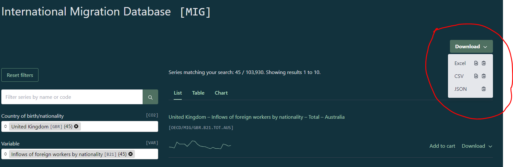
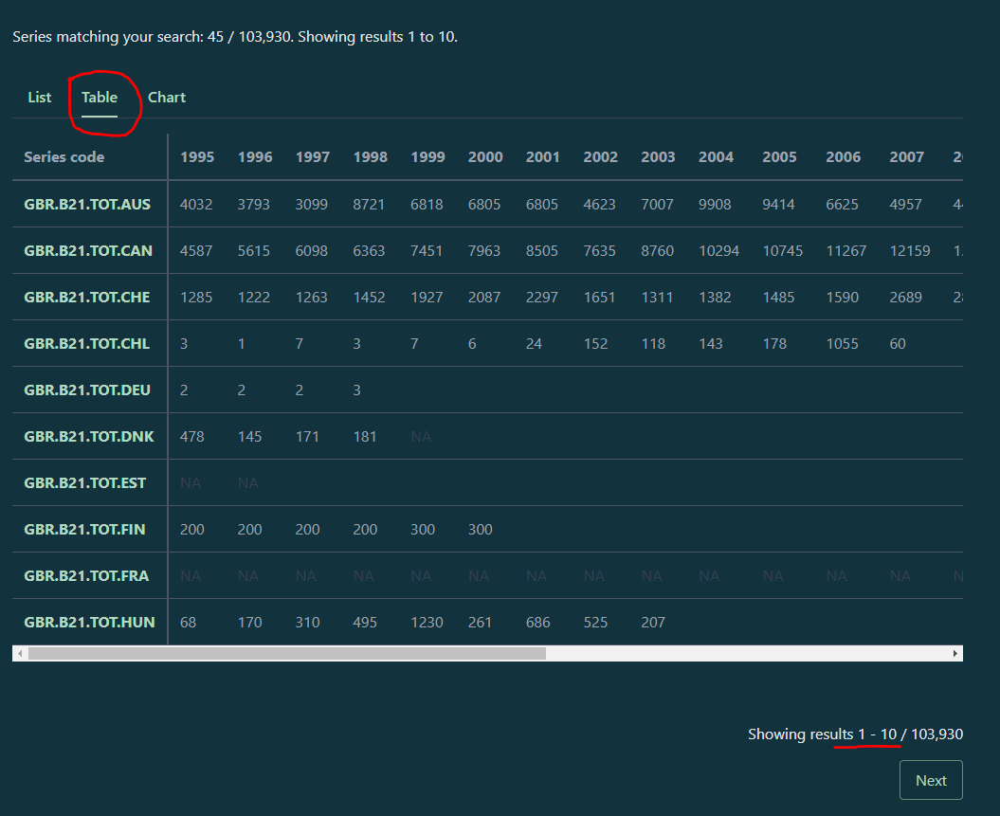
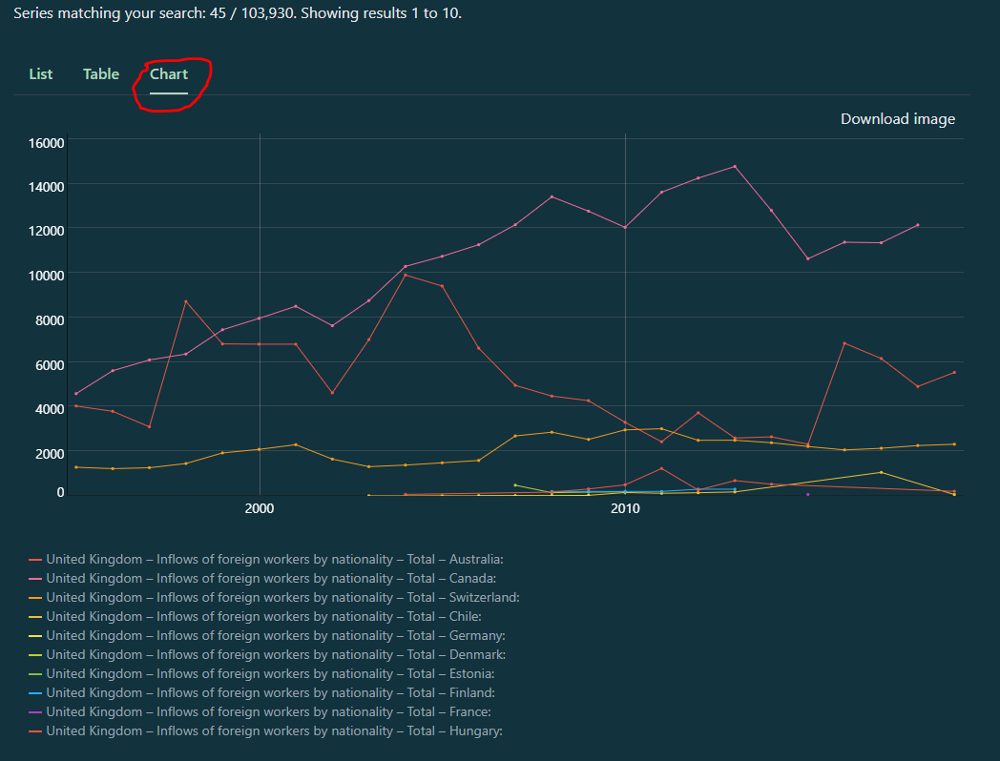

class: center, middle, inverse

# DBnomics

### How to explore and download open-source data from DBnomics using R, Python, and Excel (if things are that desperate)

By David Sands

2022-09-28

```{r setup, include=FALSE}
options(htmltools.dir.version = FALSE)
knitr::opts_chunk$set(warning = FALSE, message = FALSE)
```

---
name: intr
# Introduction

[What's DBnomics?](#what-is)

[How do you access it with R?](#r-code-1)

[How do you access it with Python?](#python-code-1)

[*Sigh* How do you access it with Excel?](#excel-01)

---
name: what-is

## What is DBnomics?

`An online collection of open source economic databases`

```{r show-db, echo = FALSE}
knitr::include_url("https://db.nomics.world/", height = "400px")
```

---
name: org

## Organisation

Data on DBnomics is grouped into three levels:

1. Provider - the name of the organisation that provides the data. E.g. OECD, World Bank, ILO;
2. Dataset - grouped indicators or measures published by the provider. This could also be a single indicator or measure E.g. from World Bank `Doing Business`, `Enterprise Surveys`. Whereas the ILO has `Child population by sex, age and rural / urban areas (thousands)` and `Child population by sex and age (thousands)`
3. Series - either a single indicator/measure from grouped ones, or a component of a single indicator. E.g. `ENF.CONT.COEN.ATDR-AE` or `ENF.CONT.COEN.ATDR-AF` from the Worl Bank's Doing Business dataset, and `AFG.BB_6361.AGE_CLDVERSION_Y12-14.GEO_COV_NAT.SEX_F.A`, or `AFG.BB_6361.AGE_CLDVERSION_Y12-14.GEO_COV_NAT.SEX_M.A` for the ILO's Child population dataset.

---
name: ways

The three major ways to explore and download data from DBnomics are:

1. [The R package `rdbnomics`](https://git.nomics.world/dbnomics/rdbnomics) 
2. [The Python package `dbnomics`](https://git.nomics.world/dbnomics/dbnomics-python-client)
3. Manually selecting Series to download from the website

---
name: r-code-1

### List of Providers

```{r prov-code}
library(rdbnomics) # Function to download data from DBnomics
library(tidyverse)

# Returning the first six providers from DBnomics
provs <- rdb_providers() # Function to 
prov_table <- provs %>% select(code, name)
knitr::kable(head(prov_table), format = "html")
```

---
name: r-code-2

### OECD Datasets

Which datasets does the OECD have?

```{r oecd-datasets}
prov_code = "OECD" # Organisation for Economic Co-operation and Development

knitr::kable(tail(rdb_datasets(provider_code = prov_code, simplify = TRUE), format = "html"))
```


---
name: r-code-3

```{r first-dataset}
data_code <- "MIG" # International Migration Database

mig_dataset_dimensions <- rdb_dimensions(
  prov_code,
  data_code,
  simplify = T # Change to the default FALSE when returning multiple datasets
)

names(mig_dataset_dimensions) # What dimensions does the MIG Dataset have?

head(mig_dataset_dimensions$CO2) # Country of Birth levels
```

Oh, what's that *International Migration Database?* Let's have a closer look...

---
name: r-code-4

```{r}
head(mig_dataset_dimensions$COU) # Destination country levels
head(mig_dataset_dimensions$GEN) # Gender levels
head(mig_dataset_dimensions$VAR) # List of variables
```

---
name: r-code-5

### List of series codes from the MIG data

These series codes show cases where the *Country of Birth* is the UK and the Variable is *Inflows of foreign workers by nationality*

```{r series}
mig_data <- rdb_series(
  prov_code,
  data_code,
  dimensions = list(CO2 = "GBR", # Country of Birth - United Kingdom
                    VAR = "B21"), # Inflows of foreign workers by nationality
  simplify = T
)
head(mig_data) 
```

---
name: r-code-6

## How to return a specific series

```{r db-data}
uk_workers_to_portugal <- rdb(
  prov_code,
  data_code,
  dimensions = list(CO2 = "GBR",
                    COU = "PRT", # Destination Country: Portugal
                    VAR = "B21")
)
```

---
name: r-code-7

```{r db-data-glimpse}
glimpse(uk_workers_to_portugal)
```

---
name: r-code-8

```{r echo=FALSE}
DT::datatable(
  uk_workers_to_portugal %>% 
  select(original_period, original_value, series_name, series_code),
  options = list(pageLength=4)
)
```

---
name: r-code-9

## How to return series via API call
```{r db-api}
api_example <- rdb(
  api_link <- "https://api.db.nomics.world/v22/series/OECD/MIG?dimensions=%7B%22CO2%22%3A%5B%22GBR%22%5D%2C%22VAR%22%3A%5B%22B21%22%5D%2C%22COU%22%3A%5B%22PRT%22%5D%7D&observations=1"
)
```

---
name: r-code-10
```{r}
glimpse(api_example)
```

---
name: r-code-11

### Example of looping through a list of World Bank series

```{r loop, eval=FALSE}
wb_country_codes <- c("DZA", "TUN", "MAR") # ISO2 Codes for Algeria, Tunisia, and Morocco

wb_indicator_codes <- c("SI.POV.DDAY", "NY.GDP.PCAP.KD.ZG", "NE.IMP.GNFS.KD",
              "NE.EXP.GNFS.KD","HD.HCI.OVRL","SH.DYN.MORT","SP.ADO.TFRT",
              "SP.POP.DPND.YG","EG.ELC.ACCS.ZS","EG.FEC.RNEW.ZS"
)


# Loop through Africa WB indicator codes and download them off of DBNomics
world_bank_data <- tibble()
for (i in 1:length(wb_indicator_codes)){
  data_i <- rdb("WB", "WDI", 
                dimensions = list(country = c(wb_country_codes),
                                  indicator = wb_indicator_codes[i]))
  world_bank_data <- rbind(world_bank_data, data_i)  
}
```


---
name: python-code-1

## Explore DBnomics with Python

```{python modules, eval = FALSE} 
import requests
import pandas as pd
import dbnomics as db
```


```{python translated-code, eval = FALSE}

prov_code = "OECD"
data_code = "MIG"

# Return list of providers using a GET request
dbnomics_providers = pd.read_json(requests.get("https://api.db.nomics.world/v22/providers?limit=100&offset=0").content.decode("UTF-8")).providers.docs

# Return list of OECD datasets using a GET request
oecd_dataset = pd.read_json(requests.get("https://api.db.nomics.world/v22/datasets/" + prov_code + "?limit=50&offset=0").content.decode("UTF-8")).datasets.docs

# Return dimensions of MIG dataset
mig_dataset_dimensions <- rdb_dimensions(
  prov_code,
  data_code,
  simplify = T # Change to the default FALSE when returning multiple datasets
)
```

---
name: python-code-2

## Return data with Python

```{python eval = FALSE}
series_info_and_data = db.fetch_series_page("https://api.db.nomics.world/v22/series/OECD/MIG?dimensions=%7B%22CO2%22%3A%5B%22GBR%22%5D%2C%22VAR%22%3A%5B%22B21%22%5D%7D&observations=1", 1)
# JSON data showing both the metadata and values of one or more series from an API call

uk_workers_to_portugal = db.fetch_series(
    provider_code=prov_code,
    dataset_code=data_code,
    dimensions = 
    {"CO2": ["GBR"],
    "COU": ["PRT"],
    "VAR": ["B21"]
    }
)

api_example = db.fetch_series_by_api_link(
  api_link = "https://api.db.nomics.world/v22/series/OECD/MIG?dimensions=%7B%22CO2%22%3A%5B%22GBR%22%5D%2C%22VAR%22%3A%5B%22B21%22%5D%2C%22COU%22%3A%5B%22PRT%22%5D%7D&observations=1"
)

series_code_example = fetch_series('OECD/MIG/GBR.B21.TOT.PRT')
```


---
name: excel-01

## Download data using Excel



```{r echo = FALSE}
knitr::include_url("https://db.nomics.world/OECD/MIG?dimensions=%7B%22VAR%22%3A%5B%22B21%22%5D%2C%22CO2%22%3A%5B%22GBR%22%5D%7D")
```

---
name: excel-02

## Download the CSV link in R or Python

#### R CSV Link

```{r db-csv-r, eval = FALSE}
csv_download_r <- read_csv("https://api.db.nomics.world/v22/series/OECD/MIG.csv?limit=1000&q=&dimensions=%7B%22VAR%22%3A%5B%22B21%22%5D%2C%22CO2%22%3A%5B%22GBR%22%5D%7D")
```

#### Python CSV Link

```{python db-csv-py, eval = FALSE}
csv_download_python = pd.read_csv("https://api.db.nomics.world/v22/series/OECD/MIG.csv?limit=1000&q=&dimensions=%7B%22VAR%22%3A%5B%22B21%22%5D%2C%22CO2%22%3A%5B%22GBR%22%5D%7D)
```

---
name: pic-1

## Other ways to explore data on the DBnomics website

### Table View



---
name: pic-2

### Chart View



---
name: when-to

# When to use DBnomics?

When you are asked for some external data - especially if it's economic one - quickly check the website to see if its there.


Some high-profile providers are the World Bank, ILO, OECD, and WHO.


Other country-specific providers are the Banque De France, Bank of England, and Statistics Poland


While more idiosyncratic providers are the The World Air Quality Index Project, Citymapper, and Freedom House

---
name: benefits

## What are the benefits of using DBnomics?

* Standardised data collection
* Reams of information already organised
* Easily incorporate data into your code and data pipelines

---
name: link

## Links

1. [Homepage](https://db.nomics.world/)
2. [API](https://api.db.nomics.world/v22/apidocs)
3. [Documentation](https://db.nomics.world/docs/)
4. [R Package](https://git.nomics.world/dbnomics/rdbnomics)
5. [R Package Tutorial](https://cran.r-project.org/web/packages/rdbnomics/vignettes/rdbnomics.html)
6. [Python Package](https://git.nomics.world/dbnomics/dbnomics-python-client)
7. [Source code of this Presentation](https://psysandsy.github.io/)

