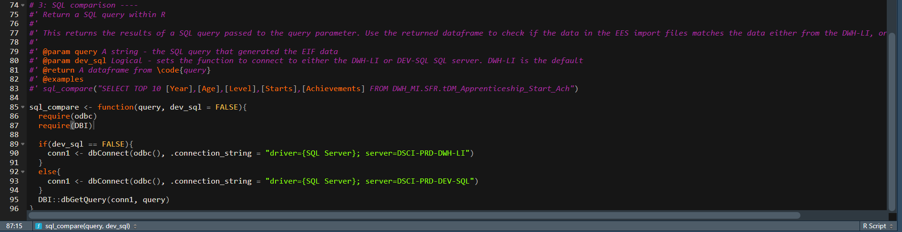
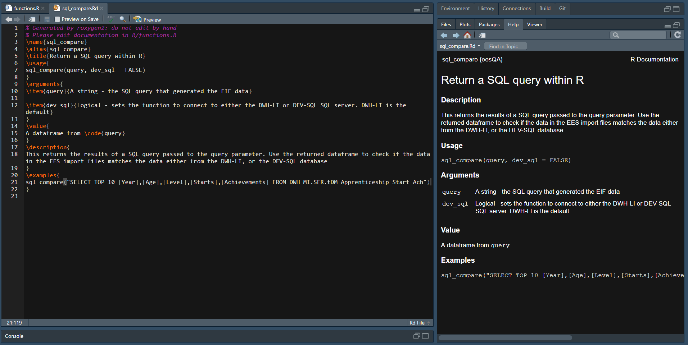

class: center, middle, inverse

# **(GASP)** I need Roxygen!

## How to use Roxygen2 to write documentation for your R functions

By David Sands

2020/05/20

```{r setup, include=FALSE}
options(htmltools.dir.version = FALSE)
knitr::opts_chunk$set(warning = FALSE, message = FALSE)
```

---
name: intro
# Introduction

> The premise of roxygen2 is simple: describe your functions in comments next to their definitions and roxygen2 will process your source code and comments to automatically generate documentation files for your functions.*

.footnote[.red[*] [Source](https://roxygen2.r-lib.org/)]

--

I will show you:

  * [How to set up Roxygen in your R Projects](#set-up); 

--
  * [Write documentation for your functions](#writing-function-file); and, 

--
  * [Generate Rd files to share the documentation you wrote](#transform)

???

Roxygen allows you to easily document your functions. This is a step-up from commenting your code. As with code documentation, function documentation makes it easier to communicate your work to others, and for them to use your code to help them. 

---
name: what-is-roxygen

# What is Roxygen?

Roxygen, technically called `roxygen2`, is an R package that generates documentation for your functions. 

With a little bit of setting up, I have found it a smashing way to describe the functions I write in my R work. 

Even though it is focused on analysts who write R packages, it is still a good habit to start writing documentation for your code **now**. 

This talk will show you how. 

---
name: demo

# A Lovely Example

First, let me give you a lovely example of using `roxygen2`. Recently, I wrote R code to _automatically_ QA the data we - the Further Education unit - import into [Explore Education Statistics](https://www.gov.uk/guidance/explore-education-statistics), the new service to publish DfE statistics. 

With this code, I wrote a couple of functions that perform the QA checks we wanted. But I wanted to create documentation for these functions so that other people in my unit (and in the futurue other people in my divison) could use them easily. 

I decided to give Roxygen a go, and was very happy with how it went. Come with me and I'll show you how I got it working...

---
name: set-up

## Set roxygen up in your R project

You know the drill by now...anytime you code in R you should [make a project](https://support.rstudio.com/hc/en-us/articles/200526207-Using-Projects) to keep your work together. Do that now.  

```
#install.packages("roxygen2")
library(roxygen2)
```
--

Then write a `DESCRIPTION` file in your project. 

Why?

Because `roxygen2` assumes you're writing an R package. It looks for this `DESCRIPTION` file to find out more info about the R package you're building. 

Now we don't want to write an R package now. But we don't need to tell R that. Let's trick it...

---
name: lol
background-image: url(https://media.giphy.com/media/AZWxR29rtAj4I/giphy.gif)
background-size: 100%

---
name: desc
## Won't get fooled again

So go on ahead, make a `DESCRIPTION` file to trick R into thinking you're writing a package. 

What's that you say...you don't know how to? Well, neither did I when I started using it. I jusy copied someone else's `DESCRIPTION` file. You do the same. Copy my text below and re-write it to whatever you're working on, then save as `DESCRIPTION`

```
Package: eesQA
Version: 0.0.1
Date: 2020-01-30
Title: Functions to QA Explore Education Statistics data
Authors@R: person("David", "Data Scientist", role = c("aut", "cre"),
                     email = "david.sands@education.gov.uk")
Author: David Sands [aut, cre]
Maintainer: David Sands <david.sands@education.gov.uk>
Depends: R (>= 4.0.0), nlme
Description: QAs the data within the Department of Education's (DfE) Explore Education Statistics (EES) Import Files (EIF). This ensures the data placed on EES is correct and accurate. 
License: GPL (>= 2)
URL: https://www.r-project.org
BugReports: https://eesQA.bugtracker.url
RoxygenNote: 7.1.0
Encoding: UTF-8
```
???

"aut" and "cre" mean author and creator respectively

---
name: writing-function-file

## How to write documentation

First, take the functions you've written and place them in an R file. Put this R file into a folder called `R`. a**RR**ight?

Then above your function code, write in roxygen comment lines. These are lines starting with `#'`. In these place the documentation of your functions. Write:

  1. The name of your function; 
  2. A description of what it does; 
  3. @param values - an explanation of the parameters in your function; 
  4. @return value - what your function returns. Is it a dataframe, a logical value, a funny picture etc?; and,
  5. A couple of @example values - showing examples of your function in action
  
---
name:example

## Example 



`roxygen2` will then take the comment lines, and convert them into `Rd` files. These are your R Documentation files. 

If you want to copy this code, the raw version is on the next slide.

---
```
# 3: SQL comparison ----
#' Return a SQL query within R
#' 
#' This returns the results of a SQL query passed to the query parameter. Use 
#' the returned dataframe to check if the data in the EES import files matches 
#' the data either from the DWH-LI, or the DEV-SQL database SQL database
#' 
#' @param query A string - the SQL query that generated the EIF data
#' @param dev_sql Logical - sets the function to connect to either the DWH-LI or DEV-SQL SQL server. DWH-LI is the default
#' @return A dataframe from \code{query}
#' @examples
#' sql_compare("SELECT TOP 10 [Year],[Age],[Level],[Starts],[Achievements] FROM DWH_MI.SFR.tDM_Apprenticeship_Start_Ach")

sql_compare <- function(query, dev_sql = FALSE){
  require(odbc)
  require(DBI)
  
  if(dev_sql == FALSE){
    conn1 <- dbConnect(odbc(), .connection_string = "driver={SQL Server}; server=DSCI-PRD-DWH-LI")
  }
  else{
    conn1 <- dbConnect(odbc(), .connection_string = "driver={SQL Server}; server=DSCI-PRD-DEV-SQL")
  }
  DBI::dbGetQuery(conn1, query)
}
```

---
name: transform

## Conjure `Rd` files

Now that you've written comments with your functions, we now need to conjure up some R documentation files (as if we're visiting the Witches of Crookback Bog)*. 

How are we going to do that? Oh easy, just type

`roxygen2::roxygenise()` in the R terminal. 

And like magic, documentation files will be generated in a new `man` directory in your project. One file will be created per function in your function R file. 

.footnote[.red[*] Please tell me someone got that reference]

---
name: transform-again

## View your documentation file

Now that you've got some `.Rd` files, let's see what they look like:


Nice! We've created a file that can render into R documentation. But _how_ do we do it?

Easy, click on the `Preview` button in the file, or type `Ctrl + Shift + K`. 

---
name: final-doc

## Final output

And after all that, we arrive at beautiful R documentation:


With this, you can reduce the overhead on people who use your code.

---
name: comp
## Comparison

Here's a comparison between your `Rd` file, and what your function documentation looks like when previewed. 



---
name: diagram

## Flow Diagram

```{r, echo=F}
DiagrammeR::mermaid("
  graph TD
  A[Function File] --> |roxygen2::roxygenise| B[man Folder]
  B -->|Preview, or Ctrl + Shift + K| C[Documentation in Help]
")
```

---
name: folder-structure

# Folder Structure
```
├── DESCRIPTION        <- Description of the package you're tricking R with
├── R
│   └── functions.R    <- File I wrote my functions in. You can have multiple
├── man                <- Made when you call roxygen2::roxygenise()
│   ├── function-01.Rd      <- Rd file of first function in functions.R.
│   ├── function-02.Rd      <- And Rd file of second function.
│   └── function-03.Rd      <- And file of the third.
```

???

Source of code folder format: https://raw.githubusercontent.com/drivendata/cookiecutter-data-science/master/README.md